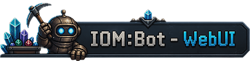
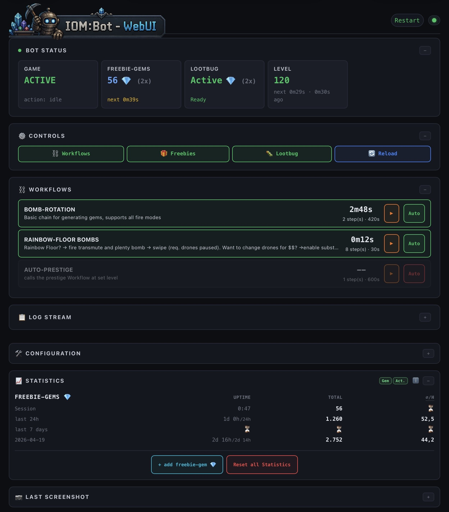
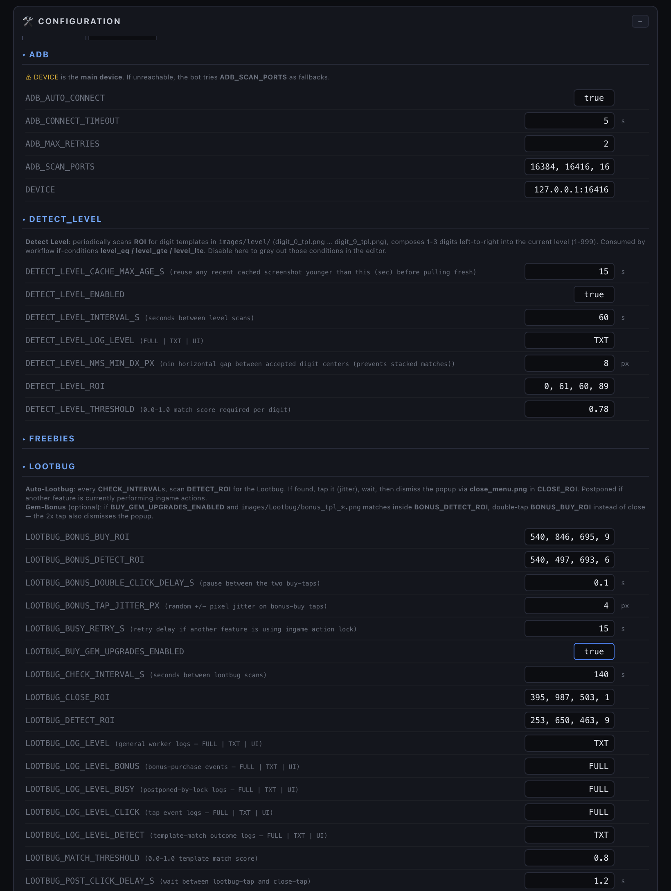
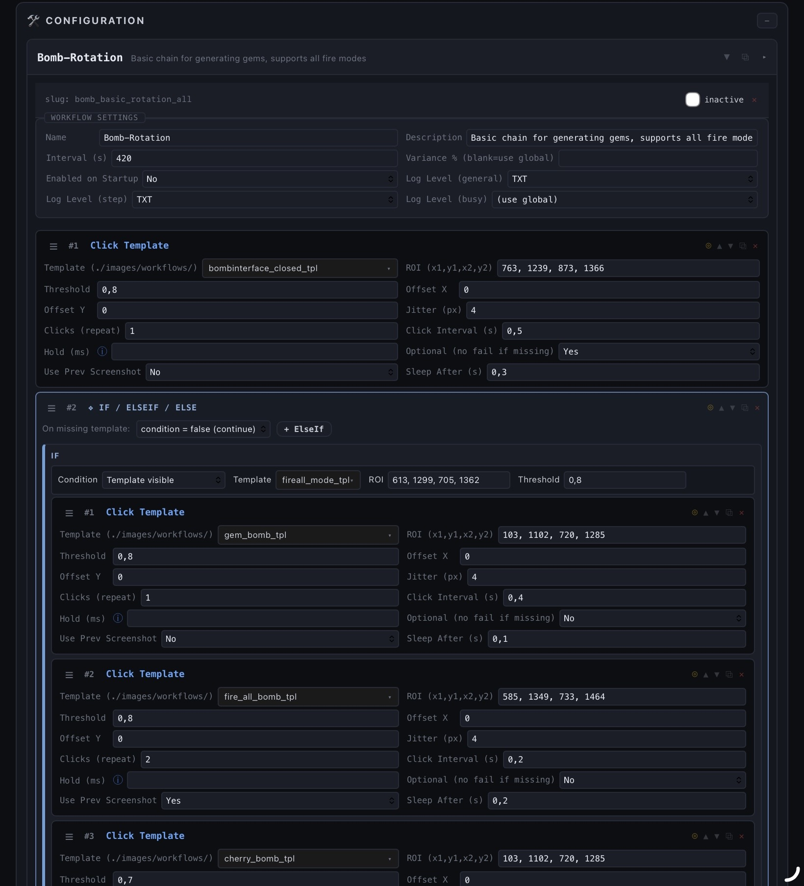
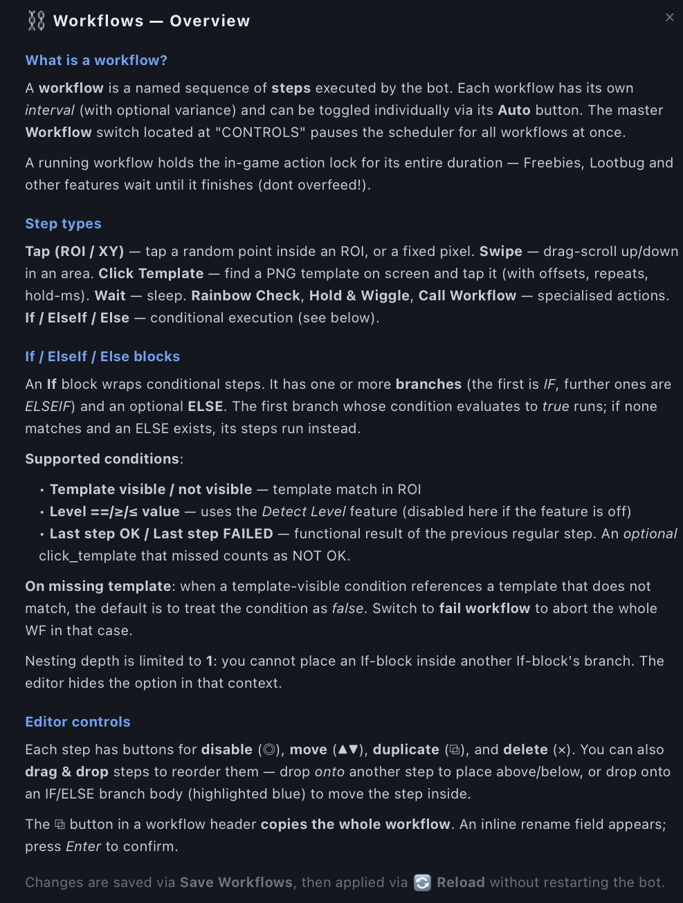
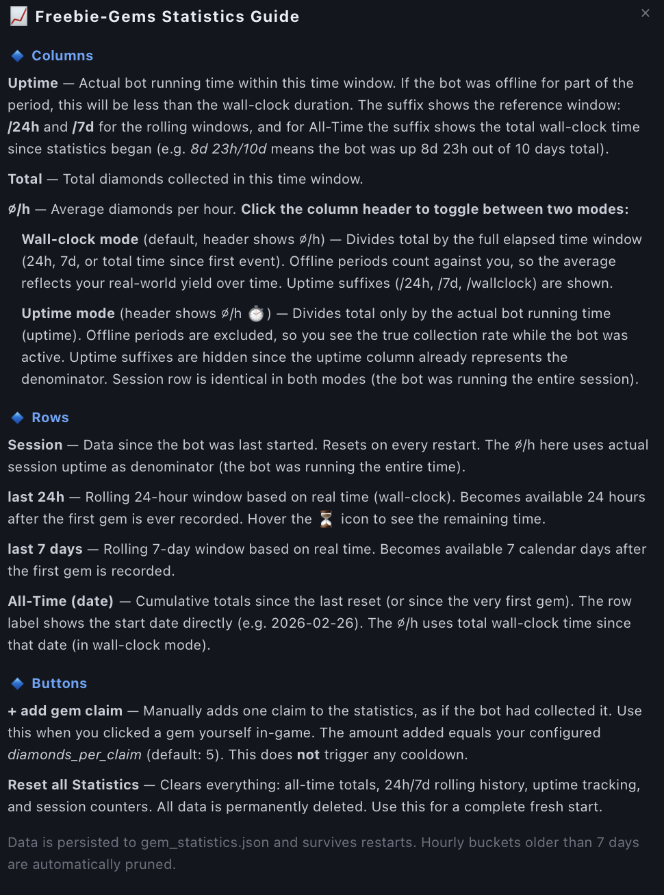

<div align="center">

  
# "Idle Obelisk Miner" Automation-Bot (Python + ADB, MEmu/MuMu)


<br>
**A "Idle Obelisk Miner" automation bot with a modern Web UI — built for MEmu/MuMu (not exclusive) via ADB.**
</div>

<br>

# ⚠️ Project Status

THIS PROJECT IS NOT RELEASED.  
It is a showcase of my development work only – used only by me and some friends.
!!!THE CODE IS NOT PUBLIC!!!
Maybe it will be released in the future — maybe not. Try to ask me ;)

---

## Table of contents
- [Features](#features)
- [Screenshots](#screenshots)
- [WebUI overview](#webui-overview)
- [Requirements](#requirements)
- [Getting started](#getting-started)
- [Configuration overview](#configuration-overview)
- [WebUI: Settings tab (custom settings)](#webui-settings-tab-custom-settings)
- [WebUI: Workflow editor](#webui-workflow-editor)
- [User overrides: where everything is stored](#user-overrides-where-everything-is-stored)
- [Reload vs Restart](#reload-vs-restart)
- [ADB auto-connect & multi-instance](#adb-auto-connect--multi-instance)
- [How it works (under the hood)](#how-it-works-under-the-hood)
- [Troubleshooting](#troubleshooting)
- [Disclaimer](#disclaimer)

---

## Features

- Reliable **freeebie-collector** + **lootbug-clicker**
- **Web Dashboard** (Flask + Socket.IO): control the bot from your PC browser **or your phone/tablet on the same WiFi**
- **Live log stream** in the WebUI + `bot.log` on disk
- **Last screenshot** viewer in the WebUI
- **Workflows**: workflows (e.g. fire bombs on golden floor, swipes, taps) + full WebUI workflow editor you can automate neary EVERYTHING ingame
- Pure **ADB input + screenshots** driven (no root, no overlays)
- Template matching via **OpenCV** (ROI-based for speed & stability), no OCR
- **ADB auto-connect** with port scanning and multi-instance fallback
- some features to prevent bot-detection

---

## Screenshots
| Screenshot |
|-----------|
| <br><sub>GUI</sub> |
| <br><sub>Settings</sub> |
| <br><sub>Workflow Config</sub> |
| <br><sub>Workflow Guide</sub> |
| <br><sub>Gem Guide</sub> |


---

## WebUI overview

When you start the bot via StartWebUI.vbs or *.bat, it prints a list of URLs like:

- `http://localhost:6001`
- `http://<your-lan-ip>:6001`


Open it in your browser. Welcome to the WebUI! It gives you:

### Controls (top bar)

- **Freebies**: pause/resume auto collecting Freebies
- **Lootbug**: enable/disable auto collecting Lootbugs
- **Workflows**: master toggle for scheduled workflows

### Panels (main area)

- **Status**: running/paused, counters, cooldowns
- **Workflows**: next scheduled execution + manual trigger
- **Screenshot tab**: auto-refresh last screenshot from the bot
- **Log stream**: live bot log output

### Security note (important)

The dashboard API is **LAN-only by default** and checks same-origin requests (see `web/security.py`).

If you *really* want public access, set environment variable:

`OBELISKBOT_ALLOW_PUBLIC=1`

…but don’t do that unless you know what you’re doing (firewall / reverse proxy / authentication).

---

## Requirements

### Emulator layout (required)

This bot is built and tuned for a **fixed emulator layout**:

- **MEmu Android 9** or **MuMu Android 12**
- **Tablet**
- **Landscape**
- **1600×900** - works also with 900x1600
- ADB enabled (standard)

Renderer (recommended):
- **DirectX** in MEmu
- **Vulkan** in MuMu

> [!IMPORTANT]
> Set the game language to **English**, otherwise template matching fails.

> [!NOTE]
> Other emulators/devices can work, but require manual ROI/template adjustments.

### Python

Use **Python 3.13 or below** (3.10–3.13 recommended).  
Newer versions may break OpenCV/NumPy on Windows.

---

## Getting started

### 1) Install location

Place the bot near your emulator `adb.exe` (optional but recommended).

### 2) Environment test
Run:
`TEST-ENVIRONMENT.bat`

### 3) Install dependencies
```bash
py -m pip install -r requirements.txt
```
### 4) check installation and adb
`TEST-ENVIRONMENT.bat`

### 5) start
`StartWebUI.vbs` or
`StartWebUI.bat`
